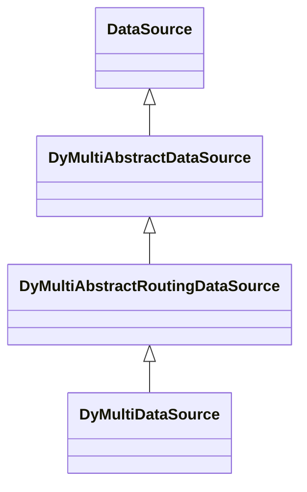

@[TOC](数据读写分离和动态数据源)

## 项目背景

关系型数据库是我们使用频率的最高的一类数据库，常见的有mysql、mysql、mysql。关系型数据库由于其ACID的特性常用于核心业务中，但是正是为了保证其ACID的特性，其插入和查询性能远不及现在的一些nosql数据库，在不得不使用关系型数据的场景中，希望能够提升一些性能，其中常见的一种解题思路是利用多数据源分担读写压力。

## 设计思路

1.设计一个服务JDBC规范的DataSource。
2.基于线程本地变量进行数据源指定切换。

## 核心实现

1.实现支持动态数据源的DataSource，实现DyMultiDataSource。

DyMultiDataSource从classpath下寻找并加载多数据源配置信息（multi-datasource.properties），
multi-datasource.properties核心配置如下：
```javascript
#数据源datasource1，基于Hikari
multi-datasource.datasource1.jdbcUrl=jdbc:mysql://127.0.0.1:3306/dbtest1?useUnicode=true&characterEncoding=utf-8&useLegacyDatetimeCode=false&serverTimezone=Asia/Shanghai&zeroDateTimeBehavior=convertToNull
multi-datasource.datasource1.username=root
multi-datasource.datasource1.password=root
multi-datasource.datasource1.type=com.zaxxer.hikari.HikariDataSource
multi-datasource.datasource1.connectionTimeout=60000
multi-datasource.datasource1.maximumPoolSize=5
multi-datasource.datasource1.poolName=datasource1

#数据源datasource2，基于Druid
multi-datasource.datasource2.url=jdbc:mysql://127.0.0.1:3306/dbtest1?useUnicode=true&characterEncoding=utf-8&useLegacyDatetimeCode=false&serverTimezone=Asia/Shanghai&zeroDateTimeBehavior=convertToNull
multi-datasource.datasource2.username=root
multi-datasource.datasource2.password=root
multi-datasource.datasource2.type=com.alibaba.druid.pool.DruidDataSource
multi-datasource.datasource2.maxWait=30000
multi-datasource.datasource2.maxActive=10

#数据源datasource3，基于Dbcp2
multi-datasource.datasource3.url=jdbc:mysql://127.0.0.1:3306/dbtest1?useUnicode=true&characterEncoding=utf-8&useLegacyDatetimeCode=false&serverTimezone=Asia/Shanghai&zeroDateTimeBehavior=convertToNull
multi-datasource.datasource3.username=root
multi-datasource.datasource3.password=root
multi-datasource.datasource3.type=org.apache.commons.dbcp2.BasicDataSource
multi-datasource.datasource3.maxTotal=10

#设置默认数据源为datasource1，datasouce2，datasouce3，当未指定具体数据源时，会从默认数据源中选择一个
multi-datasource.defaultDatasource=datasource1,datasource2,datasource3
#是否允许指定不存在的数据源，如果为true，当指定了不存在的数据源时，会使用默认数据源
multi-datasource.lenientFallback=true
```
2.实现基于线程本地变量进行数据源指定切换。
```javascript
public class DyMultiDataSourceHolder {
    //基于线程本地变量设置需要使用的数据源。
    private final static ThreadLocal<String> THREAD_DATA_SOURCE_KEY = new ThreadLocal<>();

    public static String getThreadDataSourceKey() {
        return THREAD_DATA_SOURCE_KEY.get();
    }

    public static void setThreadDataSourceKey(String dataSourceKey) {
        THREAD_DATA_SOURCE_KEY.set(dataSourceKey);
    }

    public static void clearThreadDataSourceKey() {
        THREAD_DATA_SOURCE_KEY.remove();
    }

```

## 使用模板-Jdbc
1.基于Jdbc使用默认数据源。
```javascript
public static void test1() throws Exception {
        String sql = "select * from t_user";
        DyMultiDataSource dynamicDataSource = new DyMultiDataSource();
        Connection connection = null;
        PreparedStatement ps = null;
        ResultSet rs = null;

        try {
            connection = dynamicDataSource.getConnection();
            ps = connection.prepareStatement(sql);
            rs = ps.executeQuery();
            while (rs.next()) {
                System.out.println(String.format("id:%s,name:%s,sex:%s", rs.getInt("id"), rs.getString("name"), rs.getInt("sex")));
            }
        } finally {
            if (rs != null) {
                rs.close();
            }
            if (ps != null) {
                ps.close();
            }
            if (connection != null) {
                connection.close();
            }
        }
    }
```
2.基于jdbc使用指定数据源。
```javascript
 public static void test2() throws Exception {
        String sql = "select * from t_user";
        DyMultiDataSource dynamicDataSource = new DyMultiDataSource();
        Connection connection = null;
        PreparedStatement ps = null;
        ResultSet rs = null;
        try {
            DyMultiDataSourceHolder.setThreadDataSourceKey("datasource3");//指定使用datasource3
            connection = dynamicDataSource.getConnection();
            ps = connection.prepareStatement(sql);
            rs = ps.executeQuery();
            while (rs.next()) {
                System.out.println(String.format("id:%s,name:%s,sex:%s", rs.getInt("id"), rs.getString("name"), rs.getInt("sex")));
            }
        } finally {
            DyMultiDataSourceHolder.clearThreadDataSourceKey();
            if (rs != null) {
                rs.close();
            }
            if (ps != null) {
                ps.close();
            }
            if (connection != null) {
                connection.close();
            }
        }
    }
```
## 使用模板-spring-jdbc
1.定义注解，用于设定需要使用的数据源。
```javascript
@Documented
@Retention(RetentionPolicy.RUNTIME)
@Target({ElementType.METHOD,ElementType.TYPE})
public @interface DyDataSource {
    /**
     * @Author xinlinh
     * @Description 数据源KEY值
     * @Date 2020/11/11 16:10
     * @Param []
     * @return java.lang.String
     **/
    String value();
}

```
2.定义切面类，通过代理设置需要使用的数据源。
```javascript
@Order(-1)
@Aspect
@Component
public class DyDataSourceAspect {

    /**
     * @return void
     * @Author xinlinh
     * @Description 切换数据源
     * @Date 2020/11/11 16:19
     * @Param [point, dyDataSource]
     **/
    @Before("@annotation(dyDataSource)")
    public void switchDataSource(JoinPoint point, DyDataSource dyDataSource) {
        //设置数据源key
        DyMultiDataSourceHolder.setThreadDataSourceKey(dyDataSource.value());
    }

    /**
     * @return void
     * @Author xinlinh
     * @Description 重置数据源，避免线程重用造成的数据源混乱。
     * @Date 2020/11/11 16:20
     * @Param [point, dyDataSource]
     **/
    @After("@annotation(dyDataSource)")
    public void resetDataSource(JoinPoint point, DyDataSource dyDataSource) {
        DyMultiDataSourceHolder.clearThreadDataSourceKey();
    }
}
```
3.定义动态数据源。
```javascript
@Configuration
public class BeanConfig {

    /**
     * @return javax.sql.DataSource
     * @Author xinlinh
     * @Description 创建数据源
     * @Date 2020/11/11 16:37
     * @Param []
     **/
    @Bean(name = "dyDatasource")
    public DataSource dyDatasource() {
        return new DyMultiDataSource();
    }

    /**
     * @return org.springframework.jdbc.core.JdbcTemplate
     * @Author xinlinh
     * @Description 指定JDBC使用的数据源
     * @Date 2020/11/11 16:37
     * @Param []
     **/
    @Bean
    public JdbcTemplate jdbcTemplate() {
        return new JdbcTemplate(dyDatasource());
    }

    /**
     * @return org.springframework.transaction.PlatformTransactionManager
     * @Author xinlinh
     * @Description 指定事务管理器关联的数据源
     * @Date 2020/11/11 16:38
     * @Param []
     **/
    @Bean
    public PlatformTransactionManager transactionManager() {
        return new DataSourceTransactionManager(dyDatasource());
    }
}

```
4.在service层指定需要使用的数据源。
```javascript
@Service
public class UserService {
    @Autowired
    private JdbcTemplate jdbcTemplate;

    private String sql = "select * from t_user";

    @DyDataSource("datasource1")
    public void queryFromDataSource1() {
        jdbcTemplate.query(sql, rs -> {
            while (rs.next()) {
                System.out.println(String.format("id:%s,name:%s,sex:%s", rs.getInt("id"), rs.getString("name"), rs.getInt("sex")));
            }
        });
    }

    @DyDataSource("datasource2")
    public void queryFromDataSource2() {
        jdbcTemplate.query(sql, rs -> {
            while (rs.next()) {
                System.out.println(String.format("id:%s,name:%s,sex:%s", rs.getInt("id"), rs.getString("name"), rs.getInt("sex")));
            }
        });
    }

    @DyDataSource("datasource3")
    public void queryFromDataSource3() {
        jdbcTemplate.query(sql, rs -> {
            while (rs.next()) {
                System.out.println(String.format("id:%s,name:%s,sex:%s", rs.getInt("id"), rs.getString("name"), rs.getInt("sex")));
            }
        });
    }
}

```

## 源代码及demo地址
1.源码及demo：
```javascript
https://github.com/hexinlin/multi-datasource.git
```
2.直接可用于项目中的jar包：
```javascript
https://github.com/hexinlin/multi-datasource/blob/master/jars/multi-datasource-core-1.0.0.jar
```